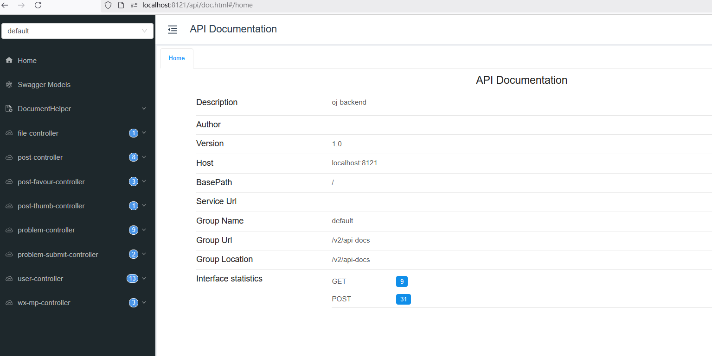

# OJsystem

Online judging system for programming problems based on Spring Boot + Spring Cloud microservices + Docker + Vue 3 + Arco Design.

## Project Log

See [`project.md`](./project.md) file for details. Project implementation progresses and notes are recorded in this file.

## oj-frontend
The project is based on the scaffold [Vue-CLI](https://cli.vuejs.org/#getting-started)
### Project setup

```
npm install
```
It supports compiling and hot-reloads for development

### Quick run

1. Make sure the server url is adapted to your server url

In `\frontend\generated\client.gen.ts`, make sure the baseURL is modified to your server address
```tsx
// my configuration
export const client = createClient({
  ...createConfig(),
  baseURL: "http://localhost:8121/",
  withCredentials: true,
});
```

2. Open `.\frontend\package.json` to select and run the script option `serve`:
```json
"scripts": {
    "serve": "vue-cli-service serve",
    "build": "vue-cli-service build",
    "lint": "vue-cli-service lint"
},
```
### Basic Views
1. Home Page

2. Problem Viewing Page

3. Login Page

4. Problem Editing Page

5. Solution Editing Page

---

## oj-backend

### Backend Part
> author: [Hhhhhunger](https://github.com/HHHHHunger98)

The backend part of OJ-System project is based on the spring-boot initial project template [springboot-init-master](https://github.com/LURENYUANSHI/springboot-init-master) by [程序员鱼皮](https://github.com/liyupi)

#### Key Highlights:

- Comprehensive Tech Stack:
    1. Spring Boot 2.7.x
    2. Spring MVC
    3. MyBatis Plus
    4. Supports AOP, transactions, scheduled tasks, global exception handling, etc.

- Pre-Integrated Utility Libraries:
    Hutool, Lombok, Gson, Easy Excel, and more to boost development efficiency
- Rich Business Features:
    1. User System: Registration, login, and permission management
    2. Post Management: CRUD operations, likes, favorites
    3. Problem Management: CRUD operations, solution submission
    4. Code Judging Sandbox: Organized by business logic
- Quick Configuration & Setup:

    application.yml includes TODO markers for easy customization of database, Redis, ES, etc.
    Provides SQL scripts & Elasticsearch index mappings
    Integrated with Swagger + Knife4j for online API testing

### Quick Use

#### MySQL Database

1）Modify the database configuration in `application.yml`：

```yml
spring:
  datasource:
    driver-class-name: com.mysql.cj.jdbc.Driver
    url: jdbc:mysql://localhost:3306/ojsystem_db
    username: root
    password: 123456
```

2）run the `sql/create_table.sql` to create tables

3）build and run project，accessing the API documentation at `http://localhost:8101/api/doc.html` for online debugging and testing


