# Project Implementation Note

## project requirement(frontend):

### software and frameworks

1. Node.js (v18.20.6 LTS)
2. npm (10.2.8)

## project initialization:

Vue-CLI: A scaffolding system for rapid Vue project development

## introduction of components

## global state management

### what is vuex?

vuex: https://vuex.vuejs.org/
Vuex is a state management pattern + library for Vue.js applications.


### why we need vuex?

we can use the vuex to make the user information global and accessible to all the component in the application.

Basically, VUEX provides us APIs for CRUD operation on global variables(state information), and also some other features(such as time travel)

- states: the state information, such as user information
- mutations: similar to events, each mutation has a string type and a handler, When a mutation with type `increment` is triggered, call its handler.

Get the state of variable:

```tsx
const store = useStore();
console.log(store.state.user?.loginUser);
```

- actions: similar to mutations, but instead of mutating state, actions commit mutations, Actions can contain arbitrary asynchronous operations.

Commit a mutation:

```tsx
setTimeout(() => {
  store.dispatch("user/getLoginUser", {
    userName: "wzh",
  });
}, 3000);
```

## Permission Management

### Purpose:

use a generalized mechanism to define the need of permission for accessing a page.

#### mechanism:

1. define the accessing authority of a specific route in the `routes.ts` file.
2. For the `components`, we define a global router listener. Each time when accessing a new page, check first according to the next route information, whether the user has the authority to access the current page.
3. If the user has the authority, jumps directly to the page, otherwise, intercept the access and goes to `401` page or login page.

## Layout Optimization (29.01.2025)

1. the page footer is not fixed at the bottom when scaling the browser:


Solution: change the position property from `absolute` to `sticky`. In the meanwhile, restrict the height of the layout

```css
#basicLayout .footer {
  position: sticky;
}
```

```html
<a-layout style="min-height: 100vh" \></a-layout>
```

2. Content style, GlobalHeader style optimization.
3. globalHeader wrap problem solved by adding `:wrap="false"`.

## General navigation bar component

### task 1

To hide unnesseray content to unauthorized user, this part is additional part to general component implementation.

#### solution

1. add a flag variable `hideInMenu` to the routes indicating that whether to show the route to the user or not.

```tsx
{
  path: "/hidden",
  name: "hidden",
  component: HomeView,
  meta: {
    hideInMenu: true,
  },
},
```

2. filter out all unnesseray routes according to the flag, and then show them on browser.

```tsx
const visibleRoutes = routes.filter((item, index) => {
  if (item.meta?.hideInMenu) {
    return false;
  }
  return true;
});
```

## Global Permission Management

### purpose

Based on requirement, we only show the menu items according to the user authority. If the user does not have the permission to access a page, we will not show them on the navigation bar.

So we need a global-wise enumeration variable for denoting the access permission level.

### define the enum variable

1. create a directory called `./src/access`
2. add a typescript file with:

```tsx
const ACCESS_ENUM = {
  NOT_LOGIN: "notLogin",
  USER: "user",
  ADMIN: "admin",
};

export default ACCESS_ENUM;
```

### extract the authority check in a module

create the `checkAccess.ts` file.

```tsx
const checkAccess = (loginUser: any, needAccess = ACCESS_ENUM.NOT_LOGIN) => {
  // get the login type of the current user, if there are no loginUser, get NOT_LOGIN by default.
  const loginUserAccess = loginUser?.userRole ?? ACCESS_ENUM.NOT_LOGIN;

  if (needAccess === ACCESS_ENUM.NOT_LOGIN) {
    return true;
  }
  // if the user need to login first.
  if (needAccess === ACCESS_ENUM.USER) {
    if (loginUser === ACCESS_ENUM.NOT_LOGIN) {
      return false;
    }
  }
  // if the user need the admin permission
  if (needAccess === ACCESS_ENUM.ADMIN) {
    //if the user does not have the admin permission
    if (loginUser !== ACCESS_ENUM.ADMIN) {
      return false;
    }
  }

  return true;
};
export default checkAccess;
```

### dynamically update navigation menu according to state changes

Modify the dynamic menu `GlobalHeader` to ensure filtering out unnesseray pages according to the login state changes. Using the `computed()` function. When the user state is changed, the rerendering of navigation menu is triggered.

```tsx
const visibleRoutes = computed(() => {
  return routes.filter((item, index) => {
    if (item.meta?.hideInMenu) {
      return false;
    }
    if (
      !checkAccess(store.state.user.loginUser, item?.meta?.access as string)
    ) {
      return false;
    }
    return true;
  });
});
```

### Global initialization, only called when initializing project

```tsx
const doInit = () => {
  // todo: to add some initialization code here
  console.log("hello, welcome to OJ system!");
};

onMounted(() => {
  doInit();
});
```

## Backend(30.01.2025)

## Backend Framework Initialization

We found a general spring-boot based backend project template from github:
[SpringBoot Project Initialization Template for Backend Project: https://github.com/LURENYUANSHI/springboot-init-master/tree/master](https://github.com/LURENYUANSHI/springboot-init-master/tree/masterhttps://www.genome.gov/)

### The architecture of the springboot-init template

- `\doc`: for documentation
- `\sql`: for sql files(`create_table.sql` initialization script for database)
  - user table
  - post table
  - post likes table `post_thumb`: which user liked which post
  - post added to favorite table `post_favour`: who had added the post to his favorite list
  - `post_es_mapping.json`: the mapping file to create the database in Elasticsearch.
- `src\....\annotation`: for annotation files
- `src\....\aop`: files for AOP, Aspect-oriented programming, for example the global authority check, the global log updating, adding new feature to existing classes without changing the original code.
- `src\....\common`: some common templates, for example generalized `basicResponse` and `deleteRequest`
- `src\....\config`: configuration files, for loading the config content defined in `application.yml`, for initializing some setting in Client side.
- `src\....\constant`: definition of const variables.
- `src\....\controller`: receive request
- `src\....\esdao`: similar to the `mapper` in `mybatis`, for manipulating ES.
- `src\....\exception`: global handler for exceptions.
- `src\....\job`: task related, scheduled task, one-time task, recurring task.
- `src\....\manager`: service layer(usually we put the definition of common service here, for instance, third-party API).
- `src\....\mapper`: data accessing layer of `mybatis`, for managing databases.
- `src\....\model`: data model for handling the data, entity classes, wrapper classes, enum types.
- `src\....\service`: service layer, for business logic.
- `src\....\utils`: utility classes, static methods.
- `src\test`: unit testing,
- `MainApplication`: Entrance of the application
- `Dockerfile`: for building docker images.

## Front-End and Back-End Integration

> how can they be integrated?

**API / Request**, the frontend sends requests to call the API from backend, solution: `Axios`

### Install Axios

> what is axios?

Axios is Promise based HTTP client for the browser and node.js

Documentation: [https://axios-http.com/docs/intro](https://axios-http.com/docs/intro)

```sh
npm install axios
```

### Write the code to call back-end!(31.01.2025)

Traditionally, we need to write the code for each request individually. At least a request path.

But there are some automatic ways for doing this:
[https://github.com/ferdikoomen/openapi-typescript-codegen](https://github.com/ferdikoomen/openapi-typescript-codegen)

> Updated Usage Information: Currently the project `ferdikoomen/openapi-typescript-codegen` has been unmaintained for a while, the alternative can be `@hey-api/openapi-ts`.

```sh
# using openapi-typescript-codegen
npm install openapi-typescript-codegen --save-dev

# usage examples:

openapi --input ./example.json --output ./directory --client axios

#using openapi-ts
npm install @hey-api/client-fetch && npm install @hey-api/openapi-ts -D

#quick use of openapi-ts
npx @hey-api/openapi-ts \
  -i path/to/openapi.json \
  -o src/client \
  -c @hey-api/client-fetch
```

Project openapi-ts: [https://github.com/hey-api/openapi-ts](https://github.com/ferdikoomen/openapi-typescript-codegen)

#### generate the client api tsx code.

```sh
npx @hey-api/openapi-ts -i http://localhost:8121/api/v2/api-docs -o ./generated -c @hey-api/client-axios
```

the HTTP client for this project is based on Axios, so the client is set to `client-axios`

#### configuration of client

There are two types of way for configuring the request.

1. Configure the generated API:

In `client.gen.ts`, we can specify our client configuration. we need to specify the server url for using the generated API, the client url is http://localhost:8080/ by default

```tsx
export const client = createClient({
  ...createConfig(),
  baseURL: "http://localhost:8121/",
});
```

2. Modify the global variables of Axios using a interceptors

Doc: [https://axios-http.com/docs/interceptors](https://axios-http.com/docs/interceptors)

#### Sent request to server using API, for example, get the user login information

```tsx
actions: {
  async getLoginUser({ commit, state }, payload) {
    // todo remote login
    const res = await getLoginUserUsingGet();
    if (res.status === 200) {
      commit("updateUser", res.data);
    } else {
      commit("updateUser", {
        ...state.loginUser,
        userRole: ACCESS_ENUM.NOT_LOGIN,
      });
    }
    console.log(res.status);
  },
},
```

## User Login Implementation

### Auto Sign-In

- Task 1: Get the user remote login information

For good maintainability, we write code in `store/user.ts`

```tsx
actions: {
    async getLoginUser({ commit, state }, payload) {
      // todo remote login
      const res = await getLoginUserUsingGet();
      if (res.data?.code === 0) {
        commit("updateUser", res.data.data);
      } else {
        commit("updateUser", {
          ...state.loginUser,
          userRole: ACCESS_ENUM.NOT_LOGIN,
        });
      }
    },
  },
```

- task 2: How to trigger the `getLoginUser()`?

we should make it globally, since we run this piece of code for once, and we need to access the result more times in many use cases.

Solutions:

1. route interceptions
2. application entrance `App.vue`
3. make this function a common global component

### Global Permission Management Optimization (02.02.2025)

1. create a new file "access/index.ts"

put all the access checking logic into this file as well as the auto login check

```tsx
router.beforeEach(async (to, from, next) => {
  // get loginUser state information
  const loginUser = store.state.user.loginUser;

  // if the user hasn't logged in before, auto login
  if (!loginUser || !loginUser.userRole) {
    // get the user state information after the login process done.
    await store.dispatch("user/getLoginUser");
  }

  const needAccess = (to.meta?.access as string) ?? ACCESS_ENUM.NOT_LOGIN;

  // when jumps to a page that requires login.
  if (needAccess !== ACCESS_ENUM.NOT_LOGIN) {
    // if the user hasn't logged in, jumps to login page.
    if (!loginUser || !loginUser.userRole) {
      next("/user/login?redirect=${to.path}");
      return;
    }
    // already logged in, but need admin authority level
    if (!checkAccess(loginUser, needAccess)) {
      next("/noAuth");
      return;
    }
  }
  next();
});
```

### Interceptors for configuring the request and response

As we are using the `@hey-api/client-axios` for HTTP requests and responses handling, we are able to modify the requests and responses via the interceptors. See [https://heyapi.dev/openapi-ts/clients/axios](https://heyapi.dev/openapi-ts/clients/axios)

1. create a directory `./plugins`, let's put all the customized plugin files into this directory.
2. create a script `./plugins/axios.ts` and cat the following configuration at the end of this file.

```tsx
import { client } from "../../generated/client.gen";

client.instance.interceptors.request.use(
  // do something
  function (config) {
    // Do something before request is sent
    return config;
  },
  function (error) {
    // Do something with request error
    return Promise.reject(error);
  }
);

// Add a response interceptor
client.instance.interceptors.response.use(
  function (response) {
    console.log("response:", response);
    // Any status code that lie within the range of 2xx cause this function to trigger
    // Do something with response data
    return response;
  },
  function (error) {
    // Any status codes that falls outside the range of 2xx cause this function to trigger
    // Do something with response error
    return Promise.reject(error);
  }
);
```

3. And import `plugins` in `main.ts`, Now we are able to customized our requests and responses. for instance, we can print out the response by:

```tsx
client.instance.interceptors.response.use(function (response) {
  console.log("response:", response);
  // Any status code that lie within the range of 2xx cause this function to trigger
  // Do something with response data
  return response;
});
```

### Optimization of supporting multiple layouts

1. add some new routes in `router/routes.ts`

```tsx
export const routes: Array<RouteRecordRaw> = [
  {
    path: "/user",
    name: "User",
    component: UserLayout,
    children: [
      {
        path: "/user/login",
        name: "User Login",
        component: UserLoginView,
      },
      {
        path: "/user/register",
        name: "User Register",
        component: UserRegisterView,
      },
    ],
  },
];
```

2. create new pages: `UserLayout`,`UserLoginView` and `UserRegisterView`
3. Adding logic for generating pages according to the route with different layouts in `App.vue`.

```tsx
<div id="app">
  <template v-if="route.path.startsWith('/user')">
    <router-view />
  </template>
  <template v-else>
    <BasicLayout />
  </template>
</div>
```

### User login page implementation

Like the classic Login Page in many other applications:

1. Introduce a form element in `UserLoginView.vue` to get the user input using `Arco Design`

```tsx
<div id="userLoginView">
    <h1 style="margin-bottom: 32px">Welcome to my Online Judge System!</h1>
    <a-form
      style="max-width: 480px; margin: 0 auto"
      label-align="left"
      auto-label-width
      :model="form"
      @submit="handleSubmit"
    >
      <a-form-item
        field="userAccount"
        tooltip="Password must be at least 8 characters."
        label="account"
      >
        <a-input
          v-model="form.userAccount"
          placeholder="please enter your user account"
        />
      </a-form-item>
      <a-form-item field="userPassword" label="userPassword">
        <a-input-password
          v-model="form.userPassword"
          placeholder="please enter your password"
        />
      </a-form-item>
      <a-form-item>
        <a-button type="primary" html-type="submit" style="width: 200px"
          >Login</a-button
        >
      </a-form-item>
    </a-form>
  </div>
```

2. get user input from the form element

```tsx
const form = reactive({
  userAccount: "",
  userPassword: "",
} as UserLoginRequest);
```

3. When clicking login button, the `handleSubmit()` function will be triggered, the page will jump to root page when the login post request succeed.

```tsx
const handleSubmit = async () => {
  const { data, error } = await userLoginUsingPost({
    body: form,
  });
  if (error) {
    console.log(error);
    return;
  }

  // Login succeed
  if (data.code === 0) {
    await store.dispatch("user/getLoginUser");
    router.push({
      path: "/",
      replace: true,
    });
  } else {
    // Login failed
    Message.error("login failed:" + data.message);
  }
};
```

## Backend API Implementation

### System Functions Overview(03.02.2025)

> Checklist of the to-do plan

1. User Module
   1. Register(Backend √)
   2. Login(Frontend √ Backend √)
2. Problem Module
   1. Create new problem(Admin)
   2. Delete problem(Admin)
   3. Modify problem(Admin)
   4. Search problem(User)
   5. Online solution editing(Problem description page)
3. Online Judge Module
   1. Submit the solution to judge system(To check correctness of the solution)
   2. Error handling(Stack overflow, Security, Timeout)
   3. Code running sandbox(security sandbox)
   4. Open API(provide a new individual service)

### Tables

#### User table

```sql
-- create user table
create table if not exists user
(
    id           bigint auto_increment comment 'id' primary key,
    userAccount  varchar(256)                           not null comment 'account name',
    userPassword varchar(512)                           not null comment 'password',
    unionId      varchar(256)                           null comment 'WeChat open platform id',
    mpOpenId     varchar(256)                           null comment 'WeChat Official Account openId',
    userName     varchar(256)                           null comment 'user name',
    userAvatar   varchar(1024)                          null comment 'user avatar',
    userProfile  varchar(512)                           null comment 'user profile',
    userRole     varchar(256) default 'user'            not null comment 'user role type：user/admin/ban',
    createTime   datetime     default CURRENT_TIMESTAMP not null comment 'time created',
    updateTime   datetime     default CURRENT_TIMESTAMP not null on update CURRENT_TIMESTAMP comment 'update time',
    isDelete     tinyint      default 0                 not null comment 'is deleted',
    index idx_unionId (unionId)
) comment 'user' collate = utf8mb4_unicode_ci;
```

#### Problem table

A problem item need at least following properties

1. Title
2. Content
   1. Introduction
   2. Input/Output example
   3. Description
3. Tags(using json array): for example, difficulty, stack, queue. etc.
4. Solution
5. Submit times: for statistic analysis

> judge configuration(json object)

- time limit
- space limit

> judge cases(json array)

each element representing a test case:

```json
[
  {
    "input": "1, 2",
    "output": "3, 4"
  }
]
```

```sql
-- problem table
create table if not exists problem
(
    id         bigint auto_increment comment 'id' primary key,
    title      varchar(512)                       null comment 'title',
    content    text                               null comment 'content',
    tags       varchar(1024)                      null comment 'tags array（json array）',
    solution   text                               null comment 'solution to the problem',
    submitNum  int      default 0                 not null comment 'total submit times',
    acceptNum  int      default 0                 not null comment 'total accepted times',
    judgeCase  text null comment 'input/output cases(json array)',
    judgeConfig  text null comment 'configuration for judging(json object)'
    thumbNum   int      default 0                 not null comment 'number of likes',
    favourNum  int      default 0                 not null comment 'number of add to favorite',
    userId     bigint                             not null comment 'created user id',
    createTime datetime default CURRENT_TIMESTAMP not null comment 'created at',
    updateTime datetime default CURRENT_TIMESTAMP not null on update CURRENT_TIMESTAMP comment 'time updated',
    isDelete   tinyint  default 0                 not null comment 'is deleted',
    index idx_userId (userId)
) comment 'post ' collate = utf8mb4_unicode_ci;
```

#### Submit table

Who has submitted solution to which problem. And what is the judge result.

1. userId: who has submitted this solution
2. problemId: which problem
3. language: c++? Java? or other language
4. code: the code user submitted
5. status: judging? to be judged(pending)? succeed? or failed?
6. judgeInfo: the information of judging, for instance, the failure reason, the time costed, space consumption, etc.(json object)

```json
{
  "message": "program execution information",
  "time": 1000, // ms
  "space": 1000 // kb
}
```

> Enumeration of judge information

- Accepted
- Wrong Answer
- Compile Error
- Memory Limit Exceeded
- Time Limit Exceeded
- Output Limit Exceeded
- Presentation Error

```sql
-- submission table
create table if not exists problem_submit
(
    id         bigint auto_increment comment 'id' primary key,
    problemId  bigint                             not null comment 'problem id',
    userId     bigint                             not null comment 'user id',
    language   varchar(128)                       not null comment 'solution language',
    code       text                               not null comment 'user solution',
    judgeInfo  text                               null comment 'Information for judging(json object)'
    createTime datetime default CURRENT_TIMESTAMP not null comment 'created at',
    updateTime datetime default CURRENT_TIMESTAMP not null on update CURRENT_TIMESTAMP comment 'time updated',
    isDelete   tinyint  default 0                 not null comment 'is deleted',
    index idx_problemId (problemId),
    index idx_userId (userId)
) comment 'problem submission';
```

> In principle, introduce utility of index only when necessary, single index is better than composite index, that's because index also cost space

### Backend APIs Implementation(07.02.2025)

#### Backend implementation workflow

1. Design and create the tables based on actual requirement.
2. Generate the CRUD operations(`mapper` and `service` layers).
3. Build the `controller layer`, implement basic `CRUD` functionalities and the `permission checking`(copy and paste).
4. Customize new features based on actual business requirement.

#### Auto generating the Entity Classes, Mapper, and Service layer

To save the time for writing the boilerplate code, we can generate the `entity classes` directly from the database tables.

For achieving this, we can use `mybatis plus` for easy developing.

Documentation: `Mybatis-Plus` [https://mybatis.plus/en/guide/](https://mybatis.plus/en/guide/)

For IDEA user, the plugin `MyBatisX` can also simplify the development:

1. Install MybatisX plugin in IDEA
2. Add the database connection in IDEA
3. Select a target table and right click the table to use MybatisX
4. Specify the generate options

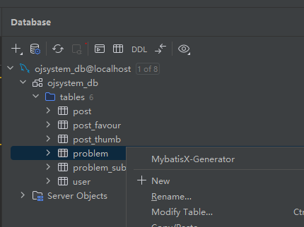

Generator option:
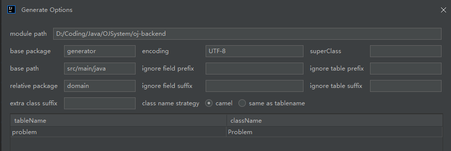

Create a new dir called model for storing DTOs(data transfer object files), entities, enums,VOs(value objects)

MybatisX Generator Result:
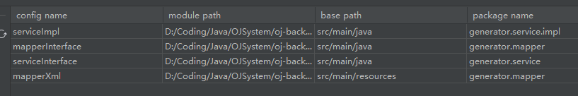

5. After generation, move the corresponding files to the corresponding folders
6. Create the controller and DTO, VO, Enums accordingly.

> Difference between `updateRequest` and `editRequest` in problem table mutation business logic: The former is designed for Administrators, the latter is designed for both user and admin

#### Create the Java classes for json objects

As mentioned above in the `Tables` chapter, the `judge configuration`, `judge information` and `judge case` are basically `json` files, for convenience, each `json` object should have the corresponding java class, for example the `JudgeInfo`

```java
package com.oj.model.dto.problemsubmit;

import lombok.Data;

/**
 * information for judging
 */
@Data
public class JudgeInfo {

    /**
     * message: program executing information
     */
    private String message;

    /**
     * time: time costed
     */
    private Long time;

    /**
     * space: storage used
     */
    private Long space;
}

```

#### Define the value object(VO) classes

> Why we need the VO classes?

The main purpose of creating a VO classes is that: we can customize the data transferred to the front-end, so that we can encapsulate the necessary related attributes together and make them immutable. In this way, the data consistency is guaranteed. Also we can save some bandwidth.

#### Implement the Controller Layer(08.02.2025)

#### Implement the Service Layer

#### Add 2 static methods to ProblemVo class

1. `public static Problem voToObj(ProblemVO problemVO)`: a static method for converting the VO object to Problem object
2. `public static ProblemVO objToVO(Problem problem)`: a static method for converting the Problem object to VO object

```java
    /**
     * Wrapper class to object
     * VO object to problem object
     * @param problemVO
     * @return
     */
    public static Problem voToObj(ProblemVO problemVO) {
        if (problemVO == null) {
            return null;
        }
        Problem problem = new Problem();
        BeanUtils.copyProperties(problemVO, problem);
        List<String> tagList = problemVO.getTags();
        if (tagList != null) {
            problem.setTags(JSONUtil.toJsonStr(tagList));
        }
        JudgeConfig judgeConfigVO = problemVO.getJudgeConfig();
        if (judgeConfigVO != null) {
            problem.setJudgeConfig(JSONUtil.toJsonStr(judgeConfigVO));
        }
        return problem;
    }

    /**
     * object to Wrapper class
     * Problem object to VO object
     * @param problem
     * @return
     */
    public static ProblemVO objToVo(Problem problem) {
        if (problem == null) {
            return null;
        }
        ProblemVO problemVO = new ProblemVO();
        BeanUtils.copyProperties(problem, problemVO);
        List<String> tagList = JSONUtil.toList(problem.getTags(), String.class);
        problemVO.setTags(tagList);
        String judgeConfigStr = problem.getJudgeConfig();
        problemVO.setJudgeConfig(JSONUtil.toBean(judgeConfigStr, JudgeConfig.class));
        return problemVO;
    }
```

#### Rewrite the `problemSubmit` class and its corresponding service API

```java
/**
* @author wzh
* @description database operation on table problem_submit(problem submission)
* @createDate 2025-02-07 13:41:24
*/
@Service
public class ProblemSubmitServiceImpl extends ServiceImpl<ProblemSubmitMapper, ProblemSubmit>
    implements ProblemSubmitService{
    @Resource
    private ProblemService problemService;

    /**
     * problem submission
     *
     * @param problemSubmitAddRequest the request of problem solution submission
     * @param loginUser
     * @return
     */
    @Override
    public long doProblemSubmit(ProblemSubmitAddRequest problemSubmitAddRequest, User loginUser) {
        // todo check if the submission language is valid
        String language = problemSubmitAddRequest.getLanguage();
        ProblemSubmitLanguageEnum problemSubmitLanguageEnum = ProblemSubmitLanguageEnum.getEnumByValue(language);
        if (problemSubmitLanguageEnum == null) {
            throw new BusinessException(ErrorCode.PARAMS_ERROR, "The submission language is invalid");
        }

        long problemId = problemSubmitAddRequest.getProblemId();
        // the entity must exist and obtain the entity according to the class
        Problem problem = problemService.getById(problemId);
        if (problem == null) {
            throw new BusinessException(ErrorCode.NOT_FOUND_ERROR);
        }
        // Whether the user already submitted the solution to the problem
        long userId = loginUser.getId();
        ProblemSubmit problemSubmit = new ProblemSubmit();
        problemSubmit.setUserId(userId);
        problemSubmit.setProblemId(problemId);
        problemSubmit.setCode(problemSubmitAddRequest.getCode());
        problemSubmit.setLanguage(language);
        // Set the initial status
        problemSubmit.setStatus(ProblemSubmitStatusEnum.PENDING.getValue());
        problemSubmit.setJudgeInfo("{}");
        boolean save = this.save(problemSubmit);
        if (!save) {
            throw new BusinessException(ErrorCode.SYSTEM_ERROR, "Problem submit failed");
        }
        return problemSubmit.getId();

        // todo refine the submission process
    }
}
```

#### Define the `Enumeration` for problem submission

1. language(c++, java, etc.)
2. problem submit status(pending, accepted, failed, etc.)
3. judge information

for instance the enumeration `ProblemSubmitLanguageEnum`

```java
public enum ProblemSubmitLanguageEnum {

    JAVA("java", "java"),
    CPLUSPLUS("c++", "c++"),
    GOLANG("golang", "golang");

    private final String text;

    private final String value;

    ProblemSubmitLanguageEnum(String text, String value) {
        this.text = text;
        this.value = value;
    }

    /**
     * 获取值列表
     *
     * @return
     */
    public static List<String> getValues() {
        return Arrays.stream(values()).map(item -> item.value).collect(Collectors.toList());
    }

    /**
     * 根据 value 获取枚举
     *
     * @param value
     * @return
     */
    public static ProblemSubmitLanguageEnum getEnumByValue(String value) {
        if (ObjectUtils.isEmpty(value)) {
            return null;
        }
        for (ProblemSubmitLanguageEnum anEnum : ProblemSubmitLanguageEnum.values()) {
            if (anEnum.value.equals(value)) {
                return anEnum;
            }
        }
        return null;
    }

    public String getValue() {
        return value;
    }

    public String getText() {
        return text;
    }
}

```

#### Test the problem controller APIs (09.02.2025)

Testing with the swagger UI

- addProblem:
  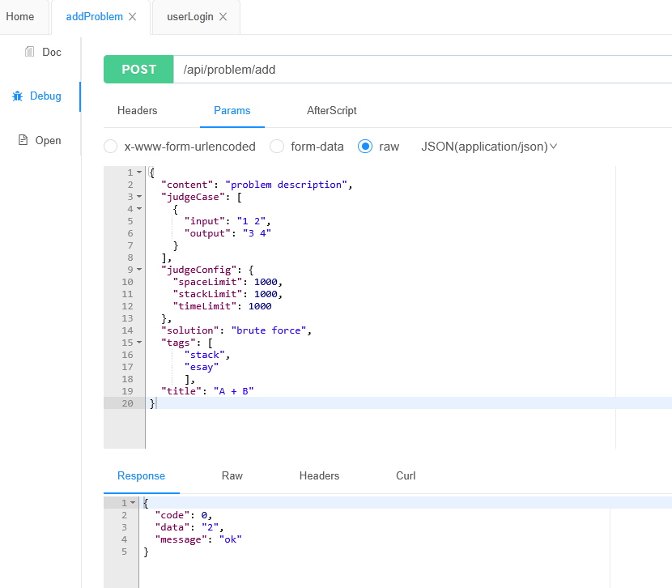

##### Optimization of TableId assignment

```java
@TableName(value ="problem")
@Data
public class Problem {
    /**
     * id
     */
    @TableId(type = IdType.ASSIGN_ID)
    private Long id;
    ...
}
```

In order to get rid of crawlers, we can change the `IdType` from `auto` to `assign_id`

| Feature                           | ASSIGN_ID           | AUTO                    |
| --------------------------------- | ------------------- | ----------------------- |
| ID Generation                     | Snowflake Algorithm | Database Auto-Increment |
| Requires Database Auto-Increment? | ❌ No               | ✅ Yes                  |
| Suitable for Distributed Systems? | ✅ Yes              | ❌ No                   |
| ID Type                           | BIGINT (default)    | Typically INT or BIGINT |
| Dependency on Database for ID?    | ❌ No               | ✅ Yes                  |

- listProblemVOByPage:
  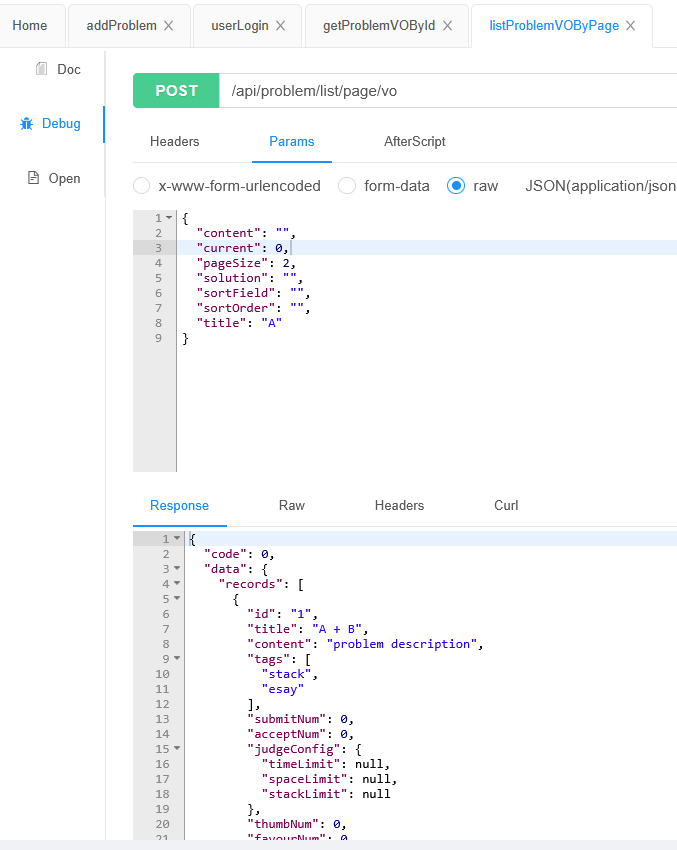
- deleteProblem:
  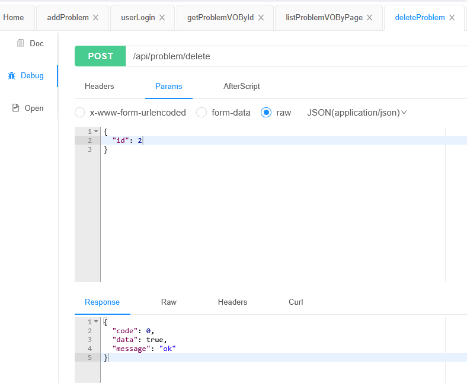
- editProblem:
  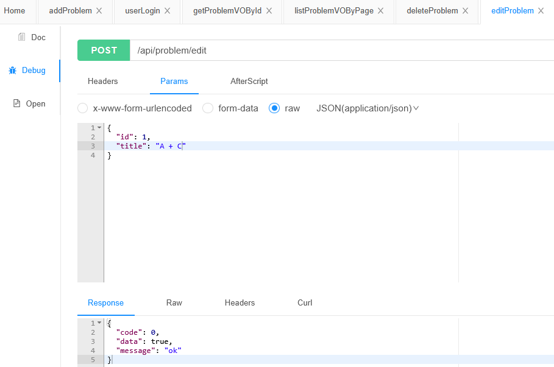
  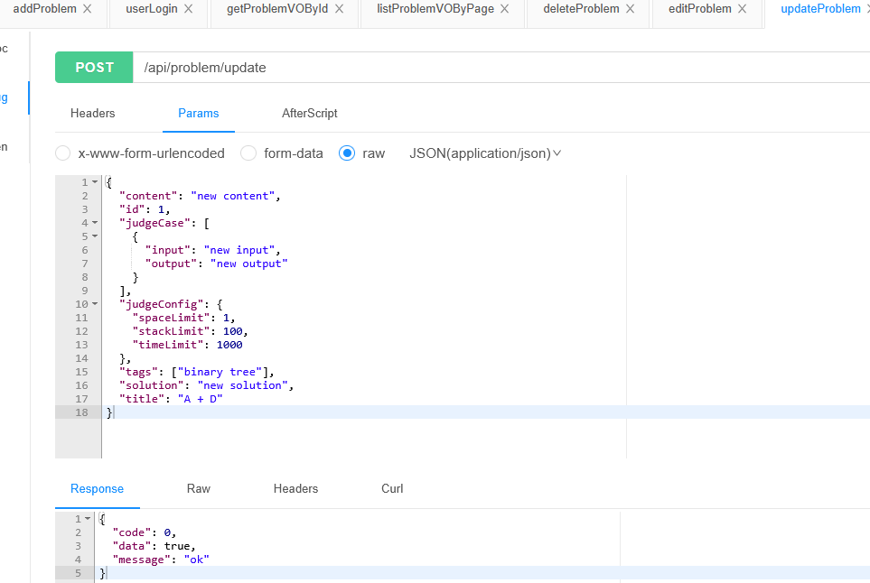

#### Implement the problem submission query request API

> Main function:

Query submission records based on `userId`, `problemId`, or `language`.

> Note:

data masking is necessary, only the current user and the admin can access the solution(submitted code)

> Approach:

Generate the request first and handle the data masking on the response based on the permission level

```java
@Override
    public ProblemSubmitVO getProblemSubmitVO(ProblemSubmit problemSubmit, User loginUser) {
        ProblemSubmitVO problemSubmitVO = ProblemSubmitVO.objToVo(problemSubmit);

        // data masking: only the current user and the admin can access the solution(submitted code)
        long userId = loginUser.getId();
        // data masking
        if (userId != problemSubmit.getUserId() && !userService.isAdmin(loginUser)) {
            problemSubmitVO.setCode(null);
        }
        return problemSubmitVO;
    }
```

## Frontend Page Implementation

In this section, the main task will be the implementation of frontend views:

- User register page
- Problem creation page (for admin)
- Problem management page (for admin)
  - Search problem
  - Delete problem
  - Edit problem
  - Quick creation
- Problem list(for user)
- Problem description page(online coding page)
  - Judging status page
- Problem submit page
- User info page

### Components requirement

> Firstly, we need to test the some components that we may probably use in the project, so that we can save more debugging time for later pages' development

#### Markdown Editor: bytemd

For enabling the users to edit their solution and notes online, a `Markdown editor` is required.

- Why to integrate a Markdown editor?
  1. Easy to Write and Read
  2. Portable & Cross-Platform
  3. Lightweight & Fast
  4. Perfect for Version Control

Markdown is simple, lightweight, and widely supported, making it an ideal choice for documentation, note-taking, and web content!

Markdown editor used in here: [`bytemd`](https://github.com/pd4d10/bytemd) https://github.com/pd4d10/bytemd

- Installation

```sh
npm install @bytemd/vue-next
```

- Component import

  1. In `main.ts`

```tsx
import "bytemd/dist/index.css";
```

2. Create a component `MdEditor.vue` in `\components` dir

```tsx
<script setup lang="ts">
import gfm from "@bytemd/plugin-gfm";
import highlight from "@bytemd/plugin-highlight";
import { Editor, Viewer } from "@bytemd/vue-next";
import { ref } from "vue";

const plugins = [
  gfm(),
  highlight(),
  // Add more plugins here
];

const value = ref("");
const handleChange = (v: string) => {
  value.value = v;
};
</script>

<template>
  <Editor :value="value" :plugins="plugins" @change="handleChange" />
</template>

<style scoped></style>
```

So we have the Markdown editor introduced!
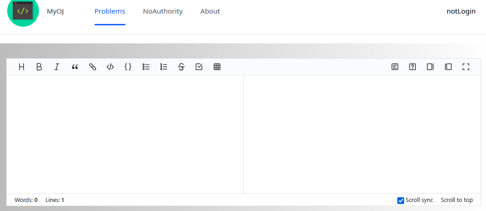

Expose the variable `value` from child component to its parent component for further processing. By defining properties, the child component is more generic for using. You can just let the parent component to handle the value change events.

#### Code Editor: Monaco-editor

For enabling the users to write code directly on our page, a `Code Editor` is required

Recommended code editor: `monaco-code`: [https://github.com/microsoft/monaco-editor](https://github.com/microsoft/monaco-editor)

- Install `Monaco-Editor`

```sh
npm install monaco-editor
```

- Install `Monaco Editor Webpack Loader Plugin`

```sh
npm install monaco-editor-webpack-plugin
```

> Configure the webpack plugin in `vue.config.js`

```tsx
const { defineConfig } = require("@vue/cli-service");
const MonacoWebpackPlugin = require("monaco-editor-webpack-plugin");
module.exports = defineConfig({
  transpileDependencies: true,
  chainWebpack(config) {
    config.plugin("monaco").use(new MonacoWebpackPlugin());
  },
});
```

- Install some dependencies

```sh
npm i @babel/plugin-transform-class-static-block @babel/plugin-transform-class-properties
```

- Create a new component view `CodeEditor.vue`

```tsx
<template>
  <div id="code-editor" ref="codeEditorRef" style="min-height: 400px"></div>
  <a-button @click="updateValue">update</a-button>
</template>
<script setup lang="ts">
import * as monaco from "monaco-editor";
import { onMounted, withDefaults, defineProps, ref, toRaw } from "vue";

const codeEditorRef = ref();
const codeEditor = ref();

/**
 * Define the component attributes
 */
interface Props {
  value: string;
  handleChange: (v: string) => void;
}
const props = withDefaults(defineProps<Props>(), {
  value: () => "",
  handleChange: (v: string) => {
    console.log(v);
  },
});

const updateValue = () => {
  if (!codeEditor.value) {
    return;
  }
  toRaw(codeEditor.value).setValue("new");
};
onMounted(() => {
  if (!codeEditorRef.value) {
    return;
  }
  codeEditor.value = monaco.editor.create(codeEditorRef.value, {
    value: props.value,
    language: "java",
    automaticLayout: true,
    // lineNumbers: "on",
    // roundedSelection: false,
    // scrollBeyondLastLine: false,
    // readOnly: false,
    theme: "vs-dark",
    minimap: {
      enabled: true,
    },
  });

  codeEditor.value.onDidChangeModelContent(() => {
    props.handleChange(toRaw(codeEditor.value).getValue());
  });
});
</script>
<style></style>
```

Here we pass the data from child element to parent element using `props` in `Vue.js`

> Final Example View(Integrated with code editor and markdown editor)

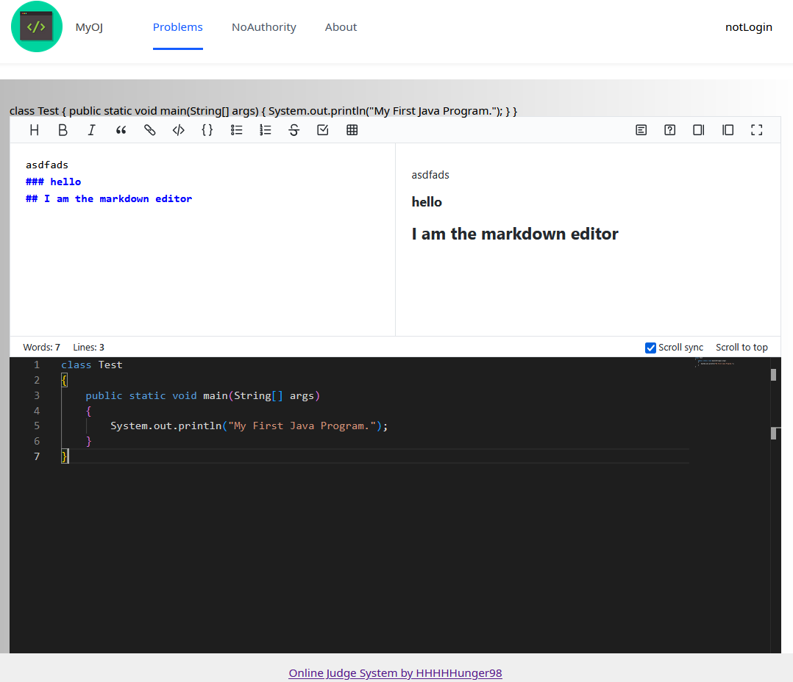

### Page Implementation

As we already tested out the necessary components, we can now implement the frontend views

#### Add Problem Page (11.02.2025)

Backend required input for create a new problem

```json
{
  "content": "",
  "judgeCase": [
    {
      "input": "",
      "output": ""
    }
  ],
  "judgeConfig": {
    "spaceLimit": 0,
    "stackLimit": 0,
    "timeLimit": 0
  },
  "solution": "",
  "tags": [],
  "title": ""
}
```

If we want to create a new problem from the client side, we should submit json file like above according to the requirement of the backend API `addProblemUsingPost`, as we generated the client-side API using `@hey-api/openapi-ts`. We should let the user to edit their problem creation

For each item in json file, we should provide related input element.

- For json key `content` and `solution`, we use the `MdEditor.vue` component to let users editing the problem with markdown editor.
- Use `Form` component from https://arco.design/vue/component/form
- Use the `nest form` from https://arco.design/vue/component/form#nest for json keys `judgeConfig` and `judgeCase`.
- Use the `dynamic form` from https://arco.design/vue/component/form#dynamic for json key `judgeCase`.

We modify the code according to the problem adding requirement: For title

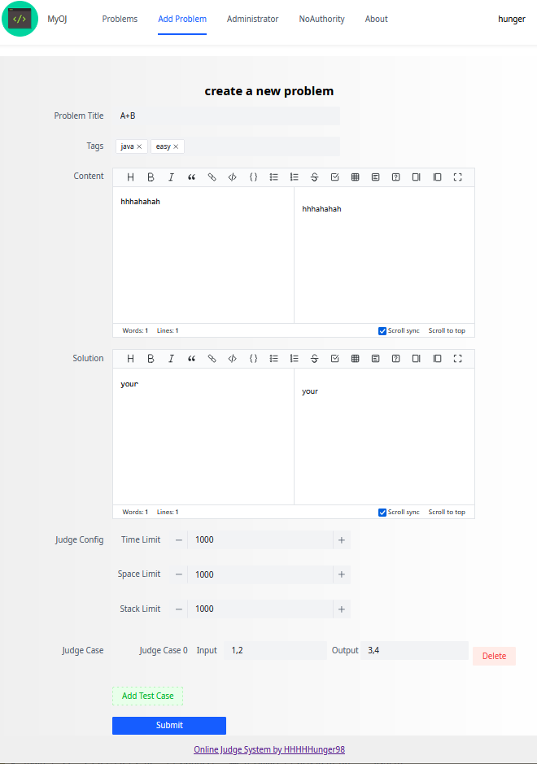

#### Manage Problem Page (12.02.2025)

Admin can manage problems on the management page
The implementation of manage problem page:

1. Use Form element from arco design: https://arco.design/vue/component/form
2. Query for the problem data from database via API `listProblemByPageUsingPost`

```tsx
// define the query configuration
const queryCondition = ref({
  pageSize: 10,
  pageNum: 1,
});
```

3. Specify the Form layout, columns and rows
4. Loading the query result

```tsx
const loadData = async () => {
  const res = await listProblemByPageUsingPost({
    body: queryCondition.value,
  });
  if (res.status === 200) {
    if (res.data.code === 0) {
      dataList.value = res.data.data.records;
      total.value = res.data.data.total;
    } else {
      Message.error("Failed:" + res.data.message);
    }
  } else {
    Message.error("Connecting to server error");
  }
};
```

5. Adjust the data format(json)
   1. use the preset properties from arco design
   2. or customize the rendering on our own
6. Add two Buttons for the editing and delete

```tsx
<template #optional="{ record }">
  <a-space>
    <a-button type="primary" @click="doEdit(record)">Edit</a-button>
    <a-button status="danger" @click="doDelete(record)">Delete</a-button>
  </a-space>
</template>

const router = useRouter();

const doDelete = async (record: Problem) => {
  const res = await deleteProblemUsingPost({
    body: {
      id: record.id,
    },
  });
  if (res.status === 200) {
    if (res.data.code === 0) {
      Message.success("Successfully deleted");
      // Updata Current Problem List View.
      loadData();
    } else {
      Message.error("Delete Operation Failed:" + res.data.message);
    }
  } else {
    Message.error("Connecting to server error");
  }
};
const doEdit = (record: Problem) => {
  router.push({
    path: "/update/problem",
    query: {
      id: record.id,
    },
  });
};
```

> Problem Manage Page

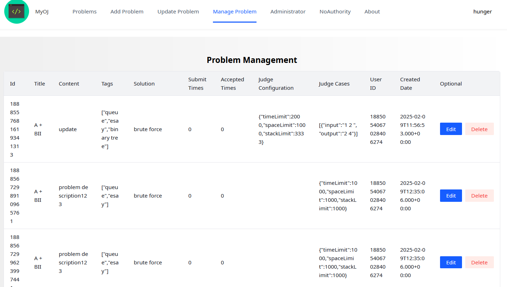

#### Update Problem Page

Due to the similarity of `update problem page` and `add problem page`
They are the same `Form` element for editing the problem
So for reusing the component, There is no need to create a new page layout for 
the update page, we can just reuse the add problem page
> key points of reusing

1. How to distinguish between the update and add page
   1. By route(`/add/problem` and `/update/problem`)
   2. By request header(`id=1`)
2. Compare to `add problem page`, the update page should do at least following jobs:
   1. When loading the update page, should also load the current problem data
   2. when clicking submit button, the request API should be `UpdateProblemUsingPostDate`

> Load current problem data when click edit button

1. Implement a `getProblemById` api at backend `backend\src\main\java\com\oj\controller\ProblemController.java`
```java
@GetMapping("/get")
public BaseResponse<Problem> getProblemById(long id,  HttpServletRequest request) {
    if (id <= 0) {
        throw new BusinessException(ErrorCode.PARAMS_ERROR);
    }
    Problem problem = problemService.getById(id);
    if (problem == null) {
        throw new BusinessException(ErrorCode.NOT_FOUND_ERROR);
    }
    // If you are not the creator of the problem, or you are not the admin, you are unable to get the entire problem information
    User loginUser = userService.getLoginUser(request);
    if (!problem.getUserId().equals(loginUser.getId()) && !userService.isAdmin(loginUser)) {
        throw new BusinessException(ErrorCode.NO_AUTH_ERROR);
    }
    return ResultUtils.success(problem);
}
```
2. The data is not masked, we need to convert the JSON file to js object in `frontend\src\views\problem\AddProblemView.vue`
```tsx
const loadData = async () => {
  const problemId = route.query.id as any;
  if (!problemId) {
    return;
  } else {
    const res = await getProblemByIdUsingGet({
      query: {
        id: problemId,
      },
    });
    if (res.status === 200) {
      if (res.data?.code === 0) {
        /**
         * JSON to js object
         * Best way to do the conversion is to put it at the backend,
         * implement a API for requesting problem data by id and handling the type conversion
         */
        form.value = res.data.data as any;
        if (!form.value.judgeConfig) {
          form.value.judgeConfig = {
            spaceLimit: 1000,
            stackLimit: 1000,
            timeLimit: 1000,
          };
        } else {
          form.value.judgeConfig = JSON.parse(form.value.judgeConfig as any);
        }
        if (!form.value.judgeCase) {
          form.value.judgeCase = [
            {
              input: "",
              output: "",
            },
          ];
        } else {
          form.value.judgeCase = JSON.parse(form.value.judgeCase as any);
        }
        if (!form.value.tags) {
          form.value.tags = [];
        } else {
          form.value.tags = JSON.parse(form.value.tags as any);
        }
      } else {
        Message.error("Get problem data failed" + res.data?.message);
      }
    } else {
      Message.error("No response from server");
    }
  }
};
``` 
3. Use route information to check which API should we call, `updateProblemUsingPost` or `addProblemUsingPost`

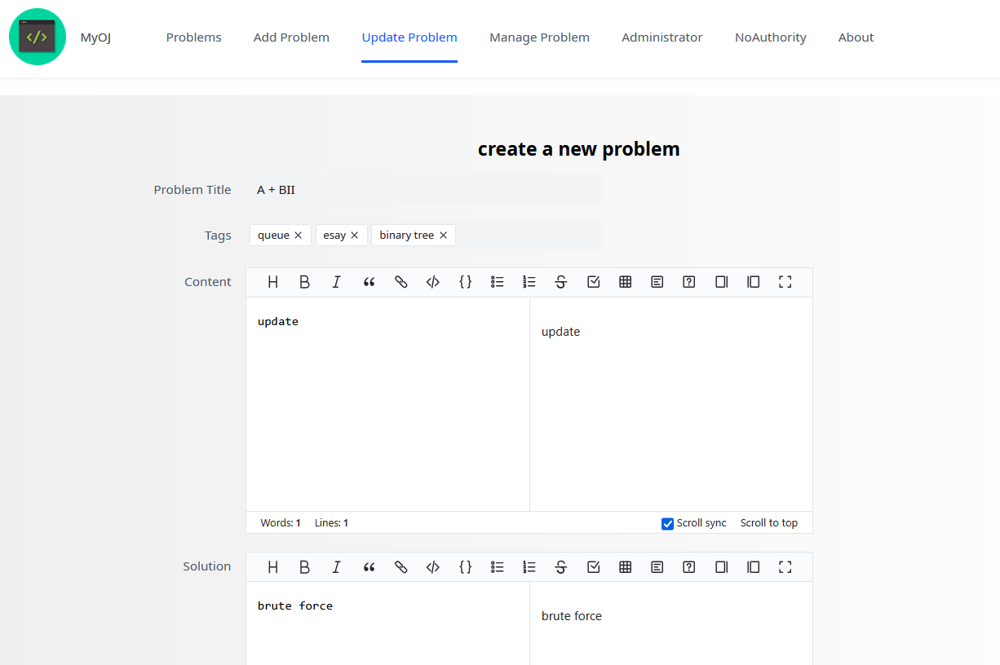

#### Frontend Part Optimization

> Page Optimization

1. Optimize the permission control in the route file
2. Optimize the hidden page in the route file

Use the properties `meta.hideInMenu` and `meta.access` to control in `router/routes.ts`
```tsx
meta: {
  hideInMenu: true,
  access: ACCESS_ENUM.ADMIN,
},
```

> Bug fixing

1. when doing the listProblemByPage, unable to change page

solution: bind the `@page-change` event to trigger a value change of `queryCondition.value.current`,
listen the change of `queryCondition`, when changing, then trigger the `loadData()` to reload the data in other page

```tsx
const onPageChange = (page: number) => {
  queryCondition.value = {
    ...queryCondition.value,
    current: page,
  };
};
/**
 * listen the change of loadDate, for example:
 * when the variable queryCondition.current change, then do the page reload
 */
watchEffect(() => {
  loadData();
});
```

2. After logged in, when reloading the page, always jumps to the login page

Causes: After user successfully logged in, the `loginUser` is still `ACCESS_ENUM.NOT_LOGIN`

Solution: after user logged in, change the `loginUser` value to corresponding `loginUser.userRole`

```tsx
// if the user hasn't logged in before, auto login
if (!loginUser || !loginUser.userRole) {
  // get the user state information after the login process done.
  await store.dispatch("user/getLoginUser");
  // update the loginUser after user login.
  loginUser = store.state.user.loginUser;
}
```

