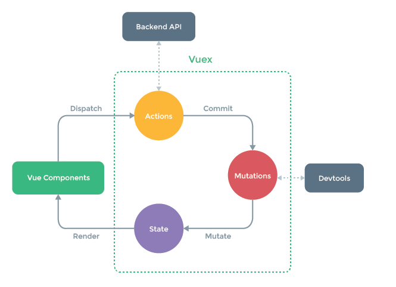
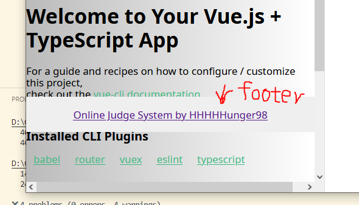

# Project Implementation Note

## project requirement(frontend):

### software and frameworks

1. Node.js (v18.20.6 LTS)
2. npm (10.2.8)

## project initialization:

Vue-CLI: A scaffolding system for rapid Vue project development

## introduction of components

## global state management

### what is vuex?

vuex: https://vuex.vuejs.org/
Vuex is a state management pattern + library for Vue.js applications.



### why we need vuex?

we can use the vuex to make the user information global and accessible to all the component in the application.

Basically, VUEX provides us APIs for CRUD operation on global variables(state information), and also some other features(such as time travel)

- states: the state information, such as user information
- mutations: similar to events, each mutation has a string type and a handler, When a mutation with type `increment` is triggered, call its handler.

Get the state of variable:

```tsx
const store = useStore();
console.log(store.state.user?.loginUser);
```

- actions: similar to mutations, but instead of mutating state, actions commit mutations, Actions can contain arbitrary asynchronous operations.

Commit a mutation:

```tsx
setTimeout(() => {
  store.dispatch("user/getLoginUser", {
    userName: "wzh",
  });
}, 3000);
```

## Permission Management

### Purpose:

use a generalized mechanism to define the need of permission for accessing a page.

#### mechanism:

1. define the accessing authority of a specific route in the `routes.ts` file.
2. For the `components`, we define a global router listener. Each time when accessing a new page, check first according to the next route information, whether the user has the authority to access the current page.
3. If the user has the authority, jumps directly to the page, otherwise, intercept the access and goes to `401` page or login page.

## Layout Optimization (29.01.2025)

1. the page footer is not fixed at the bottom when scaling the browser:



Solution: change the position property from `absolute` to `sticky`. In the meanwhile, restrict the height of the layout

```css
#basicLayout .footer {
  position: sticky;
}
```

```html
<a-layout style="min-height: 100vh" \></a-layout>
```

2. Content style, GlobalHeader style optimization.
3. globalHeader wrap problem solved by adding `:wrap="false"`.

## General navigation bar component

### task 1

To hide unnesseray content to unauthorized user, this part is additional part to general component implementation.

#### solution

1. add a flag variable `hideInMenu` to the routes indicating that whether to show the route to the user or not.

```tsx
{
  path: "/hidden",
  name: "hidden",
  component: HomeView,
  meta: {
    hideInMenu: true,
  },
},
```

2. filter out all unnesseray routes according to the flag, and then show them on browser.

```tsx
const visibleRoutes = routes.filter((item, index) => {
  if (item.meta?.hideInMenu) {
    return false;
  }
  return true;
});
```

## Global Permission Management

### purpose

Based on requirement, we only show the menu items according to the user authority. If the user does not have the permission to access a page, we will not show them on the navigation bar.

So we need a global-wise enumeration variable for denoting the access permission level.

### define the enum variable

1. create a directory called `./src/access`
2. add a typescript file with:

```tsx
const ACCESS_ENUM = {
  NOT_LOGIN: "notLogin",
  USER: "user",
  ADMIN: "admin",
};

export default ACCESS_ENUM;
```

### extract the authority check in a module

create the `checkAccess.ts` file.

```tsx
const checkAccess = (loginUser: any, needAccess = ACCESS_ENUM.NOT_LOGIN) => {
  // get the login type of the current user, if there are no loginUser, get NOT_LOGIN by default.
  const loginUserAccess = loginUser?.userRole ?? ACCESS_ENUM.NOT_LOGIN;

  if (needAccess === ACCESS_ENUM.NOT_LOGIN) {
    return true;
  }
  // if the user need to login first.
  if (needAccess === ACCESS_ENUM.USER) {
    if (loginUser === ACCESS_ENUM.NOT_LOGIN) {
      return false;
    }
  }
  // if the user need the admin permission
  if (needAccess === ACCESS_ENUM.ADMIN) {
    //if the user does not have the admin permission
    if (loginUser !== ACCESS_ENUM.ADMIN) {
      return false;
    }
  }

  return true;
};
export default checkAccess;
```

### dynamically update navigation menu according to state changes

Modify the dynamic menu `GlobalHeader` to ensure filtering out unnesseray pages according to the login state changes. Using the `computed()` function. When the user state is changed, the rerendering of navigation menu is triggered.

```tsx
const visibleRoutes = computed(() => {
  return routes.filter((item, index) => {
    if (item.meta?.hideInMenu) {
      return false;
    }
    if (
      !checkAccess(store.state.user.loginUser, item?.meta?.access as string)
    ) {
      return false;
    }
    return true;
  });
});
```

### Global initialization, only called when initializing project

```tsx
const doInit = () => {
  // todo: to add some initialization code here
  console.log("hello, welcome to OJ system!");
};

onMounted(() => {
  doInit();
});
```
